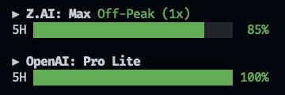
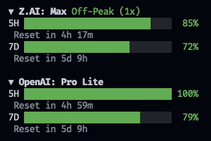

# opencode-tools

> [!NOTE]
> Heavily inspired by:
> - [the upstream project](https://github.com/slkiser/opencode-quota)
> - [farrukh2002/opencode-glm-reset](https://github.com/farrukh2002/opencode-glm-reset)

OpenCode TUI plugins that show quota usage, reset countdowns, rate-limit
status, compact homepage summaries, MCP server health, active-session context
and spend, LSP status, synchronized session TODOs, and `/tokens_*` reports for **Z.AI (GLM)**,
**OpenAI (ChatGPT Plus/Pro)**, and **OpenCode Go**.


<table>
  <tr>
    <td width="50%">
      
    </td>
    <td width="50%">
      
    </td>
  </tr>
  <tr>
    <td width="50%" align="center">OpenCode Tools TUI sidebar panel</td>
    <td width="50%" align="center">OpenCode Tools TUI sidebar panel extended</td>
  </tr>
</table>

## Features

### Z.AI (`zai-coding-plan`)

- **5H token quota** — remaining %, live countdown to next reset, and absolute
  token counts (`used / total`) when the plan exposes them (Max/Pro).
- **7D weekly limit** — same bar + countdown; shows "Unlimited (Legacy)"
  when the plan has no weekly cap.
- **Peak/off-peak indicator** — Peak (14:00–18:00 SGT, 3x usage)
  vs Off-Peak.
- **Limited indicator** — shows when the 5H quota is exhausted.
- **Heuristic fallback** — if the API is unreachable, scans the session's
  message parts for a reset time and falls back to a clock-based estimate.

### OpenAI (ChatGPT Plus/Pro)

- **API-reported quota windows** — primary and optional secondary windows use
  compact labels derived from their API-reported duration, such as `5H`, `7D`,
  or `1M`, and show remaining percentage plus reset countdown.
- **Plan type** — Plus / Pro / Pro Lite / Team.
- **Limited indicator** — shows when rate limit is reached.

### OpenCode Go

- **Subscription windows** — exact remaining usage for rolling 5H, weekly 7D,
  and subscription month 1M windows.
- **Shared refresh behavior** — uses the configured polling interval,
  one-second countdowns, reset-boundary refresh, and a ten-minute stale horizon
  without exhausted backoff.

### MCP

- **Reactive server health** — shows OpenCode's synchronized MCP server list in
  source order without polling.
- **Native status roles** — connected, disabled, failed, authentication, and
  client-registration states use compact labels and status-colored bullets.
- **Persistent collapse state** — remembers the user's preference while an
  empty MCP list stays compact as a muted `0/0` summary.

### Context

- **Reactive active-session metrics**: updates context and spend values from
  synchronized session and message state without polling.
- **Newest positive assistant token selection**: sums finite detailed `input`,
  `output`, `reasoning`, `cache.read`, and `cache.write` buckets and uses the
  newest assistant message whose sum is positive.
- **Cumulative finite assistant spend**: sums finite assistant-message costs for
  the active session and ignores missing or non-finite costs.
- **Unavailable values**: shows `Tokens -`, `Used -`, and `Spent $0.00` when the
  host has not supplied usable context data.
- **Persistent collapse state**: remembers the user's header-click preference.

### LSP

- **Reactive server list** — shows OpenCode's synchronized LSP IDs in source
  order without polling.
- **Status-colored bullets** — successful servers use the success color,
  failed servers use the error color, and unknown statuses remain in the list
  with a muted bullet.
- **Persistent collapse state** — remembers the user's header-click preference
  and shows `LSPs will activate as files are read` when the expanded list is
  empty.

### TODO

- **Synchronized session scope** — shows the active session's TODO records in
  source order without polling.
- **Status markers** — uses `[✓]` for completed, `[•]` for in-progress, `[ ]`
  for pending or unknown, and `[-]` for cancelled records.
- **Aligned wrapped rows** — reserves four cells for each marker so continuation
  lines align beneath the content column. An empty list shows
  `No TODOs for this session`.
- **Persistent collapse state** — remembers the user's header-click preference
  and summarizes completed records over all session records.

### Shared

- **Homepage summary** — each provider plugin also registers a compact homepage
  line, such as `Z.AI: Max; 93%/84%` or `OpenAI: Pro Lite; 96%/84%`.
- **`/tokens_*` commands** — server plugin providing token usage and cost
  reports: `/tokens_today`, `/tokens_daily`, `/tokens_weekly`, `/tokens_monthly`,
  `/tokens_all`, `/tokens_session`, `/tokens_session_all`, `/tokens_between`.
  Reads from `opencode.db` with full models.dev pricing resolution.
- **Color-coded bars** — green above 30% remaining, amber at ≤30%,
  red at ≤10% remaining.
- **Provider names, plan types, and bar labels** use the theme foreground
  colour; only the bar fills and percentages are colour-coded.
- **Smart polling (Z.AI and OpenAI)** — checks the quota API every 10s by
  default, backing off to 5min when the primary window is exhausted.
- **Expandable** — click the header to show weekly / tool / absolute details.
- **Stale handling** — keeps showing the last known data through transient
  fetch failures and marks `stale` in the right-aligned provider header.

## Local-only usage

The plugins are built and loaded only from local files. This package is not
published to npm, and OpenCode is never configured with an npm package spec.
OpenCode 1.18.1 or newer is required for the standalone TUI plugin and
synchronized MCP, Context, LSP, and TODO state APIs.

### Configuration

Native TUI options can be supplied with the local plugin entry:

```json
{
  "$schema": "https://opencode.ai/tui.json",
  "plugin": [
    [
      "./opencode-tools-quota.js",
      {
        "quota": {
          "refreshIntervalSeconds": 10,
          "progressColors": {
            "enabled": true,
            "errorBelow": 10,
            "warningBelow": 30
          },
          "percentageMode": "remaining",
          "hideInactive": false,
          "openai": { "hideInactive": false },
          "zai": { "hideTools": false, "hideInactive": false },
          "opencodego": {
            "workspaceId": "wrk_TESTWORKSPACE",
            "workspaceToken": "TOKEN_TEST_ONLY_DO_NOT_USE",
            "hideInactive": false
          },
          "otherProviders": { "sortDirection": "desc" }
        }
      }
    ],
    "./opencode-tools-home.js",
    "./opencode-tools-token-report.js",
    "./opencode-tools-mcp.js",
    "./opencode-tools-context.js",
    "./opencode-tools-lsp.js",
    "./opencode-tools-todo.js"
  ],
  "plugin_enabled": {
    "internal:sidebar-mcp": false,
    "internal:sidebar-lsp": false,
    "internal:sidebar-todo": false
  }
}
```

Context ships as a separate opt-in artifact. Enable it by adding
`./opencode-tools-context.js` to the `plugin` array.

The entries must remain standalone. Only quota accepts the options object;
home, token-report, MCP, Context, LSP, and TODO use string entries. MCP,
Context, LSP, and TODO accept no options. Context has no built-in panel override
to disable. The other external panels do not deactivate their built-in
counterparts. Users must disable `internal:sidebar-mcp`,
`internal:sidebar-lsp`, and `internal:sidebar-todo` themselves, as shown by
`plugin_enabled`, to avoid duplicate panels.

`quota.opencodego.workspaceId` identifies the OpenCode Go workspace.
`quota.opencodego.workspaceToken` authenticates the console request;
workspaceToken is the plaintext auth cookie value. Keep both values only in
local `.opencode/tui.json`: they must not be committed or shared, and you must
rotate the console session when it expires, is revoked, or is exposed.

The provider sends these workspace credentials only to the fixed
`https://opencode.ai` origin; they do not replace the OpenCode-managed
inference API key. The sidebar reports exact remaining usage for rolling 5H,
weekly 7D, and subscription month 1M windows. OpenCode Go reads the
undocumented Solid hydration contract from the authenticated page and fails
closed if that contract changes. It does not scrape visible text, save page
HTML, or estimate quota from local cost.

OpenCode Go uses the shared default/custom polling interval, one-second
countdowns, reset-boundary refresh, and a ten-minute stale horizon without
exhausted backoff.

Defaults are `quota.refreshIntervalSeconds: 10`,
`quota.progressColors.enabled: true`, `quota.progressColors.errorBelow: 10`,
`quota.progressColors.warningBelow: 30`,
`quota.percentageMode: "remaining"`, `quota.hideInactive: false`,
`quota.zai.hideTools: false`, and `quota.otherProviders.sortDirection: "desc"`.
Provider `hideInactive` overrides resolve as
`providerOverride ?? quota.hideInactive ?? false`. Inactive controls affect
only configured providers that are not selected; the selected provider remains
visible. Set `quota.zai.hideTools` to `true` to remove every Z.AI tool-limit
row and its quantities.

Polling defaults to 10 seconds when its value is invalid or non-positive.
Color thresholds are clamped to `0-100`, and `errorBelow` cannot exceed
`warningBelow`. Set `quota.progressColors.enabled` to `false` to disable
semantic bar and percentage colors.

#### Breaking configuration migration

The root-level `refreshIntervalSeconds` and `progressColors` paths are ignored.
Move them to `quota.refreshIntervalSeconds` and `quota.progressColors`
respectively. The legacy root-level `otherProviders` object is also ignored:
move `otherProviders.percentageMode` to `quota.percentageMode` and
`otherProviders.sortDirection` to `quota.otherProviders.sortDirection`.

### MCP sidebar layouts

MCP names truncate before the right-aligned status label. Every line remains
within the 37-cell sidebar width and contains no trailing whitespace.

#### Expanded

```text
▼ MCP
-------------------------------------
• codegraph-global          Connected
• context7-global           Connected
• postgres-test-vendsystem   Disabled
• postgres-test-vendsystem…  Disabled
-------------------------------------
```

#### Collapsed, all connected

```text
▶ MCP                             2/2
-------------------------------------
```

#### Collapsed, attention needed

```text
▶ MCP                             2/3
-------------------------------------
```

#### Collapsed, empty

```text
▶ MCP                             0/0
-------------------------------------
```

For the healthy `2/2` summary, both numbers use the success color and the slash
is muted. For the unhealthy `2/3` summary, `2` uses the success color, `3` uses
the error color, and the slash is muted.
For the empty `0/0` summary, both numbers and the slash are muted.

### Context sidebar layouts

Context values come from the active session. The expanded panel uses
`Limit -`, `Tokens -`, `Used -`, and `Spent $0.00` when context values are
unavailable; the collapsed summary uses `-`. The expanded `Used` value and
collapsed summary are green below 40%, yellow from 40% through 60%, and red
above 60%. Only a `$0.00` value in the `Spent` row is muted.

#### Expanded

```text
▼ Context
-------------------------------------
Limit                            500K
Tokens                        322.12K
Used                              64%
Spent                           $0.00
-------------------------------------
```

#### Collapsed

```text
▶ Context                         64%
-------------------------------------
```

### LSP sidebar layouts

LSP IDs stay in synchronized source order. Long IDs truncate with an ellipsis
so expanded lines fit within 37 cells and collapsed lines fit within 36 cells.

#### Expanded

```text
▼ LSP
-------------------------------------
• typescript
• yaml-ls
-------------------------------------
```

#### Expanded, empty

```text
▼ LSP
-------------------------------------
LSPs will activate as files are read
-------------------------------------
```

#### Collapsed

```text
▶ LSP                               2
-------------------------------------
```

The collapsed count uses normal header text. Successful servers use a success
bullet, failed servers use an error bullet, and unknown statuses remain present
with a muted bullet. Only header clicks write the persisted collapse
preference.

### TODO sidebar layouts

TODO records stay in synchronized source order. Status markers occupy four
cells, so wrapped content continues beneath the content column without trailing
whitespace. TODO continuation lines align under the content column, and only
completed records contribute to the collapsed numerator.

#### Expanded

```text
▼ TODO
-------------------------------------
[✓] Explore existing panel patterns
[•] Implement synchronized TODO
    state and wrapped rows
[ ] Verify build and deployment
[-] Superseded task
-------------------------------------
```

#### Expanded, empty

```text
▼ TODO
-------------------------------------
No TODOs for this session
-------------------------------------
```

#### Collapsed

```text
▶ TODO                            2/5
-------------------------------------
```

### Build and deploy

Build the seven standalone minified ESM plugins and their imported shared
artifact:

```bash
npm run build:plugins
```

Deploy to this repository's `.opencode/` directory or the resolved global
OpenCode config directory (`$XDG_CONFIG_HOME/opencode`, defaulting to
`~/.config/opencode`):

```bash
npm run deploy:local
npm run deploy:global
```

Each deploy command rebuilds first and automatically migrates managed
configuration entries to the seven standalone entries in manifest order. It
preserves unrelated plugin entries and preserves existing quota options;
quota options remain attached only to the quota entry. Local deployment also
removes managed source entries from the project-root `tui.json`, because
OpenCode loads it together with `.opencode/tui.json`; options in the selected
`.opencode` config take precedence. Repeating either command produces the same
files and configuration. Deployment does not edit `plugin_enabled` or disable
the built-in MCP, LSP, or TODO panel. Set the overrides in the configuration
example yourself when replacing any built-in panel. Fully restart OpenCode after
deployment.

The normalized quota runtime ID is now `aamkye/opencode-tools-quota`. This is
an intentional ID change, so host-managed plugin state may reset during
migration; the deployer still preserves quota's configuration options.

#### Rollback

To remove the Context panel, remove `./opencode-tools-context.js` from the
`plugin` array and restart OpenCode. To return to OpenCode's built-in MCP panel,
remove `./opencode-tools-mcp.js`
from the `plugin` array, then remove the `"internal:sidebar-mcp": false`
override (or set it to `true`) to re-enable `internal:sidebar-mcp`, then restart
OpenCode. To return to OpenCode's built-in LSP panel, remove
`./opencode-tools-lsp.js` from the `plugin` array, then remove the
`"internal:sidebar-lsp": false` override (or set it to `true`) to re-enable
`internal:sidebar-lsp`, then restart OpenCode. To return to OpenCode's built-in
TODO panel, remove `./opencode-tools-todo.js` from the `plugin` array, then
remove the `"internal:sidebar-todo": false` override (or set it to `true`) to
re-enable `internal:sidebar-todo`, then restart OpenCode. To roll back the
complete standalone migration, optionally restore the prior composed release
and its configuration before restarting.

### Artifact layout

```text
dist/
├── opencode-tools-shared.js
├── opencode-tools-quota.js
├── opencode-tools-home.js
├── opencode-tools-token-report.js
├── opencode-tools-mcp.js
├── opencode-tools-context.js
├── opencode-tools-lsp.js
└── opencode-tools-todo.js
```

| File | Runtime ID | Responsibility |
| --- | --- | --- |
| `opencode-tools-shared.js` | Not registered | Imported-only provider, presentation, and token-report logic. |
| `opencode-tools-quota.js` | `aamkye/opencode-tools-quota` | Quota sidebar panel and provider polling. |
| `opencode-tools-home.js` | `aamkye/opencode-tools-home` | Compact homepage provider summary. |
| `opencode-tools-token-report.js` | `aamkye/opencode-tools-token-report` | TUI `/tokens_*` commands and reports. |
| `opencode-tools-mcp.js` | `aamkye/opencode-tools-mcp` | Reactive MCP sidebar health panel immediately after quota. |
| `opencode-tools-context.js` | `aamkye/opencode-tools-context` | Reactive active-session context and spend panel between MCP and LSP. |
| `opencode-tools-lsp.js` | `aamkye/opencode-tools-lsp` | Reactive LSP sidebar status panel immediately after Context. |
| `opencode-tools-todo.js` | `aamkye/opencode-tools-todo` | Synchronized session TODO sidebar panel immediately after LSP. |

`solid-js`, `@opentui/*`, `@opencode-ai/plugin`, host SDK modules, and
Node/Bun built-ins remain external and are provided by the OpenCode host.

### Session title plugin

Build the global hook plugin with `npm run build:session-title`. Deploy it with
`npm run deploy:session-title`; this copies only `dist/session-title.ts` to
`~/.config/opencode/plugins/session-title.ts`, which OpenCode auto-loads at
startup. Restart OpenCode after deployment. The plugin generates a one-time,
3-8 word title from the first message's selected model; later messages do not
change that title.

### Source files

| File                        | Purpose                                                               |
| --------------------------- | --------------------------------------------------------------------- |
| `tui/quota.tsx`             | Standalone quota sidebar adapter                                      |
| `tui/home.tsx`              | Standalone compact homepage adapter                                   |
| `tui/token-report.tsx`      | Standalone TUI token-report command adapter                           |
| `tui/mcp.tsx`               | Standalone reactive MCP sidebar adapter                               |
| `tui/context.tsx`           | Standalone reactive active-session context and spend sidebar adapter  |
| `tui/lsp.tsx`               | Standalone reactive LSP sidebar adapter                               |
| `tui/todo.tsx`              | Standalone synchronized session TODO sidebar adapter                  |
| `tui/providers/`            | Z.AI, OpenAI, and OpenCode Go provider adapters                       |
| `lib/tokens/`               | Vendored token reporting library ([upstream](https://github.com/slkiser/opencode-quota), MIT) |
| `plugin-manifest.json`      | Manifest order, runtime IDs, artifacts, slots, and option ownership   |
| `build-plugins.mjs`         | Builds the shared artifact and seven standalone local ESM plugins     |
| `deploy-plugins.mjs`        | Idempotently migrates seven local/global plugins and `tui.json` entries |

### Edit workflow

Edit the relevant source, redeploy, then fully restart OpenCode to reload.

```bash
npm install       # install/refresh deps in node_modules
npm run typecheck # tsc --noEmit (informational; runtime resolves via Bun)
npm run build:plugins # rebuild all seven standalone plugins plus shared code
npm run deploy:local # rebuild and deploy into this repository
npm test          # run tests
```

## Breaking migration

This project was renamed to `opencode-tools`. Replace every prior project path,
TUI entry, package name, token plugin filename, and build command with the paths
shown above. Legacy files and aliases are intentionally not provided.

## How it works

### Z.AI

1. Reads the API key from the `zai-coding-plan` provider (falls back to
   `~/.local/share/opencode/auth.json`, then `~/.config/opencode/auth.json`
   and the older `account.json` locations).
2. Polls `https://api.z.ai/api/monitor/usage/quota/limit` every 10s (5min
   when the 5H quota is exhausted).
3. Renders bars + countdowns in the sidebar; expands for absolute counts.

### OpenAI

1. Reads the OAuth access token from the `openai` provider entry in
   `auth.json` (also checks `codex`, `chatgpt`, `opencode` keys).
2. Extracts the `chatgpt_account_id` from the JWT for the
   `ChatGPT-Account-Id` header.
3. Polls `https://chatgpt.com/backend-api/wham/usage` every 10s (5min
   when the primary window is exhausted).
4. Renders the plan type and available primary/secondary quota windows with
   compact labels derived from each API-reported duration.

### OpenCode Go

1. Sends the configured workspace credentials only to the fixed
   `https://opencode.ai` origin.
2. Reads quota data from the authenticated page's undocumented Solid hydration
   contract and fails closed when that contract changes.
3. Renders the rolling 5H, weekly 7D, and subscription month 1M windows with
   shared polling, countdown, reset, and a ten-minute stale horizon without
   exhausted backoff.

### `/tokens_*` reports

1. Reads assistant messages from `opencode.db` (SQLite, via `bun:sqlite`).
2. Aggregates token usage by model, provider, and session.
3. Resolves USD costs using a bundled models.dev pricing snapshot.
4. Formats a markdown report with summary, model breakdown, and top sessions.
5. Injects the report into the session via `noReply` prompt (no model invocation).
