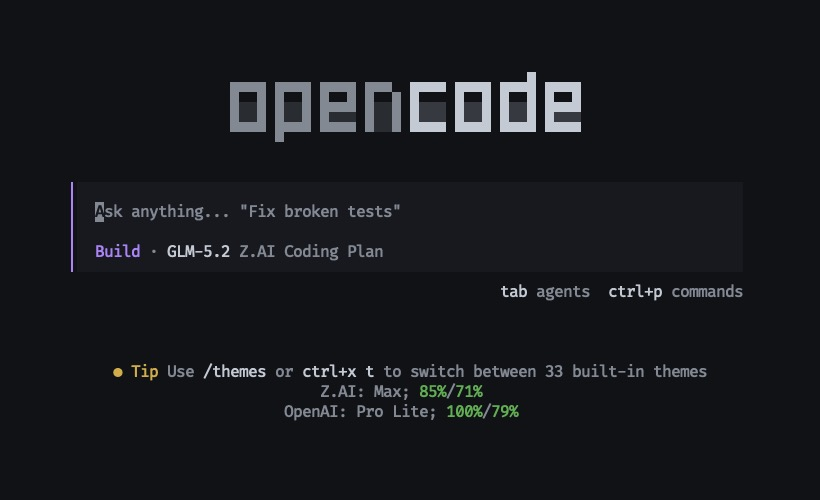
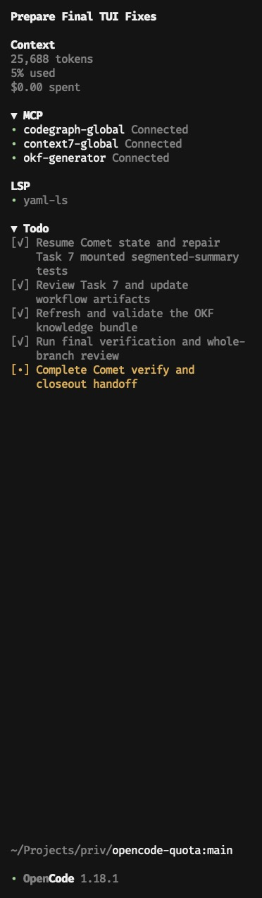
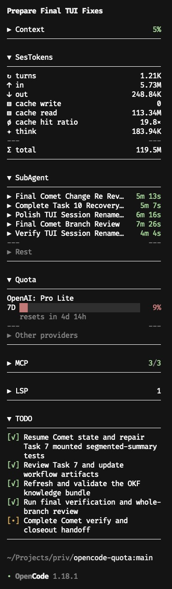

# opencode-tools

> [!NOTE]
> Heavily inspired by:
> - [the upstream project](https://github.com/slkiser/opencode-quota)
> - [farrukh2002/opencode-glm-reset](https://github.com/farrukh2002/opencode-glm-reset)
> - [Hotakus/opencode-subagent-magazine](https://github.com/Hotakus/opencode-subagent-magazine)
> - [njbraun/opencode-plugin-session-token-summary](https://github.com/njbraun/opencode-plugin-session-token-summary)

OpenCode TUI plugins that show quota usage, reset countdowns, rate-limit
status, compact homepage summaries, MCP server health, active-session context
and spend, LSP status, synchronized session TODOs, complete session-tree token
totals, direct-child SubAgent activity, and `/tokens_*` reports for **Z.AI
(GLM)**, **OpenAI (ChatGPT Plus/Pro)**, and **OpenCode Go**.



<table>
  <tr>
    <td width="50%">
      
    </td>
    <td width="50%">
      
    </td>
  </tr>
</table>

## Quick Install

Requires OpenCode 1.18.1 or newer, Git, and Node.js with npm.

```bash
git clone https://github.com/aamkye/opencode-tools.git
cd opencode-tools
npm ci
npm run deploy:global
```

Fully restart OpenCode after deployment.

## Features

### Z.AI (`zai-coding-plan`)

- **5H token quota** — remaining %, live countdown to next reset, and absolute
  token counts (`used / total`) when the plan exposes them (Max/Pro).
- **7D weekly limit** — same bar + countdown; shows "Unlimited (Legacy)"
  when the plan has no weekly cap.
- **Peak/off-peak indicator** — Peak (14:00–18:00 SGT, 3x usage)
  vs Off-Peak.
- **Limited indicator** — shows when the 5H quota is exhausted.
- **Heuristic fallback** — if the API is unreachable, scans the session's
  message parts for a reset time and falls back to a clock-based estimate.

### OpenAI (ChatGPT Plus/Pro)

- **API-reported quota windows** — primary and optional secondary windows use
  compact labels derived from their API-reported duration, such as `5H`, `7D`,
  or `1M`, and show remaining percentage plus reset countdown.
- **Plan type** — Plus / Pro / Pro Lite / Team.
- **Limited indicator** — shows when rate limit is reached.
- **ChatGPT OAuth only** — OpenAI subscription quota uses the ChatGPT usage
  endpoint and requires a valid ChatGPT OAuth session. OpenAI API keys do not
  expose ChatGPT Plus or Pro quota. A rejected session displays `ChatGPT OAuth
  session required`.

### OpenCode Go

- **Subscription windows** — exact remaining usage for rolling 5H, weekly 7D,
  and subscription month 1M windows.
- **Shared refresh behavior** — uses the configured polling interval,
  one-second countdowns, reset-boundary refresh, and a ten-minute stale horizon
  without exhausted backoff.
- **Configuration guidance** — OpenCode Go requires both
  `quota.opencodego.workspaceId` and `quota.opencodego.workspaceToken`; without
  them the panel stays visible with `Configuration required` and sends no
  console request.

### MCP

- **Reactive server health** — shows OpenCode's synchronized MCP server list in
  source order without polling.
- **Native status roles** — connected, disabled, failed, authentication, and
  client-registration states use compact labels and status-colored bullets.
- **Session-local collapse state** — resets to the configured default whenever
  the active session changes. The collapsed header shows a
  `success/warning/error` health rollup (connected, disabled, and error-state
  counts) that stays compact as a colored `0/0/0` summary when the server list
  is empty.

### Context

- **Reactive active-session metrics**: updates context and spend values from
  synchronized session and message state without polling.
- **Newest positive assistant token selection**: sums finite detailed `input`,
  `output`, `reasoning`, `cache.read`, and `cache.write` buckets and uses the
  newest assistant message whose sum is positive.
- **Cumulative finite assistant spend**: sums finite assistant-message costs for
  the active session and ignores missing or non-finite costs.
- **Unavailable values**: shows `Tokens -`, `Used -`, and `Spent $0.00` when the
  host has not supplied usable context data. When consumed tokens are known but
  the model context limit is unavailable, the panel preserves the known `Tokens`
  value and accumulated `Spent`, while `Limit`, `Used`, and the collapsed summary
  remain `-`.
- **Session-local collapse state**: resets to the configured default whenever
  the active session changes.

### LSP

- **Reactive server list** — shows OpenCode's synchronized LSP IDs in source
  order without polling.
- **Operating directory** — each row shows the basename of the server's `root`
  (the directory where it operates), right-aligned in the muted label color.
  Servers with an empty `root` show the id alone.
- **Status-colored bullets** — successful servers use the success color,
  failed servers use the error color, and unknown statuses remain in the list
  with a muted bullet.
- **Session-local collapse state** — resets to the configured default whenever
  the active session changes and shows `LSPs will activate as files are read`
  when the expanded list is empty.

### TODO

- **Synchronized session scope** — shows the active session's TODO records in
  source order without polling.
- **Status markers** — uses `[✓]` for completed, `[•]` for in-progress, `[ ]`
  for pending or unknown, and `[-]` for cancelled records.
- **Aligned wrapped rows** — reserves four cells for each marker so continuation
  lines align beneath the content column. An empty list shows
  `No TODOs for this session`.
- **Session-local collapse state** — resets to the configured default whenever
  the active session changes and summarizes `done/working/todo` counts
  (cancelled excluded) in the collapsed header.

### SesTokens

- **Assistant-only full-tree totals**: aggregates assistant messages across the
  selected root session and its complete descendant tree.
- **All detailed token buckets**: reports input, output, reasoning, cache read,
  and cache write. Total is input + output + reasoning + cache read + cache
  write; cache hit ratio is cache read / (input + cache write).
- **Compact absolute counts**: uses K/M/B suffixes with up to two decimal places
  and trimmed zeroes. The collapsed summary shows only the aggregate total.
- **Event-driven refresh**: uses a 200 ms event debounce and 2, 4, and 8 second
  retries. It does not poll or calculate cost.
- **Stale recovery**: retains the last successful snapshot as stale and
  recovers it to ready after a successful refresh.
- **Memory-only data**: Snapshots and collapse choices are memory-only. Selecting
  another session resets the panel to its configured or built-in default.

### SubAgent

- **Direct-child monitoring**: monitors direct child sessions of the selected
  parent, ordered newest first. The newest five stay in the primary group and
  older children appear under `Rest`.
- **Status precedence**: failed takes precedence over running and successful;
  busy or retry is running; idle or a completed assistant message is
  successful; otherwise the child remains running.
- **Duration and details**: each row shows a live duration for running children
  and a terminal duration for successful or failed children. Expanding a row
  shows its agent, status, time, model, and `Open Session` action.
  Compact durations and expanded time values use the child's status color.
  Compact titles are grapheme-safe and end-truncated beside a fixed seven-cell,
  right-aligned duration box with a two-cell structural margin. Expanded titles
  wrap in full without a duration reservation.
  The Rest disclosure and title are muted, and its divider is two muted three-dash segments separated by flexible space.
- **Session-local interaction state**: panel collapse, `Rest` collapse, and an
  expanded child reset whenever the active session changes. Retained failure
  evidence remains persistent per parent session.
- **Stale and empty behavior**: a failed refresh after ready data retains the
  complete entry body and marks the panel stale. Loading, unavailable, and
  unselected states emit no panel output; a ready parent without direct children
  shows `No subagents`.

### Shared

- **Homepage summary** — each provider plugin also registers a compact homepage
  line, such as `Z.AI: Max; 93%/84%` or `OpenAI: Pro Lite; 96%/84%`.
- **`/tokens_*` commands** — server plugin providing token usage and cost
  reports: `/tokens_today`, `/tokens_daily`, `/tokens_weekly`, `/tokens_monthly`,
  `/tokens_all`, `/tokens_session`, `/tokens_session_all`, `/tokens_between`.
  Reads from `opencode.db` with full models.dev pricing resolution.
- **Color-coded bars** — green above 30% remaining, amber at ≤30%,
  red at ≤10% remaining.
- **Provider names, plan types, and bar labels** use the theme foreground
  colour; only the bar fills and percentages are colour-coded.
- **Smart polling (Z.AI and OpenAI)** — checks the quota API every 10s by
  default, backing off to 5min when the primary window is exhausted.
- **Expandable** — click the header to show weekly / tool / absolute details.
- **Stale handling** — keeps showing the last known data through transient
  fetch failures and marks `stale` in the right-aligned provider header.

## Local-only usage

The plugins are built and loaded only from local files. This package is not
published to npm, and OpenCode is never configured with an npm package spec.
OpenCode 1.18.1 or newer is required for the standalone TUI plugin and
synchronized MCP, Context, LSP, TODO, session-tree, and SubAgent state APIs.

### Configuration

Native TUI options can be supplied with the local plugin entry:

```json
{
  "$schema": "https://opencode.ai/tui.json",
  "plugin": [
    "./opencode-tools-home.js",
    "./opencode-tools-token-report.js",
    "./opencode-tools-context.js",
    "./opencode-tools-ses-tokens.js",
    "./opencode-tools-subagent.js",
    [
      "./opencode-tools-quota.js",
      {
        "quota": {
          "refreshIntervalSeconds": 10,
          "progressColors": {
            "enabled": true,
            "errorBelow": 10,
            "warningBelow": 30
          },
          "percentageMode": "remaining",
          "hideInactive": false,
          "openai": { "hideInactive": false },
          "zai": { "hideTools": false, "hideInactive": false },
          "opencodego": {
            "workspaceId": "wrk_TESTWORKSPACE",
            "workspaceToken": "TOKEN_TEST_ONLY_DO_NOT_USE",
            "hideInactive": false
          },
          "otherProviders": { "sortDirection": "desc" }
        }
      }
    ],
    "./opencode-tools-mcp.js",
    "./opencode-tools-lsp.js",
    "./opencode-tools-todo.js"
  ],
  "plugin_enabled": {
    "internal:sidebar-context": false,
    "internal:sidebar-mcp": false,
    "internal:sidebar-lsp": false,
    "internal:sidebar-todo": false
  }
}
```

Context ships as a separate opt-in artifact. Enable it by adding
`./opencode-tools-context.js` to the `plugin` array.

The entries must remain standalone and in manifest order. Quota accepts the
quota options object; each sidebar panel (Context, SesTokens, SubAgent, MCP,
LSP, TODO) optionally accepts an options object with `defaultState` and `chip`.
Home and token-report use string entries.

#### Default collapse state

Any sidebar panel can be configured with `defaultState`. Whenever the active
session ID changes, including returning to a previously opened session, every
panel resets to that configured state. A missing or invalid value uses the
built-in `"expanded"` default. Header and secondary-section toggles remain local
to the currently selected session and are not persisted.

| Plugin                             | Accepted values                                           |
| ---------------------------------- | --------------------------------------------------------- |
| Context, SesTokens, MCP, LSP, TODO | `"expanded"` (default), `"collapsed"`                     |
| SubAgent, Quota                    | `"expanded"` (default), `"semi-collapsed"`, `"collapsed"` |

`"semi-collapsed"` starts the panel expanded with the secondary section (Rest /
Other Providers) collapsed; it is ignored for panels without a secondary section.

```json
["./opencode-tools-context.js", { "defaultState": "collapsed" }]
```

MCP, Context, LSP, and TODO have no built-in panel override to disable.
SesTokens has no built-in panel override. The SubAgent has no built-in panel
override. The other external panels do not deactivate their built-in
counterparts. Users must disable `internal:sidebar-mcp`, `internal:sidebar-lsp`,
and `internal:sidebar-todo` themselves, as shown by `plugin_enabled`, to avoid
duplicate panels.

`quota.opencodego.workspaceId` identifies the OpenCode Go workspace.
`quota.opencodego.workspaceToken` authenticates the console request;
workspaceToken is the plaintext auth cookie value. Keep both values only in
local `.opencode/tui.json`: they must not be committed or shared, and you must
rotate the console session when it expires, is revoked, or is exposed.

OpenCode Go requires both `quota.opencodego.workspaceId` and
`quota.opencodego.workspaceToken`; without them the panel stays visible with
`Configuration required` and sends no console request.

The provider sends these workspace credentials only to the fixed
`https://opencode.ai` origin; they do not replace the OpenCode-managed
inference API key. The sidebar reports exact remaining usage for rolling 5H,
weekly 7D, and subscription month 1M windows. OpenCode Go reads the
undocumented Solid hydration contract from the authenticated page and fails
closed if that contract changes. It does not scrape visible text, save page
HTML, or estimate quota from local cost.

OpenCode Go uses the shared default/custom polling interval, one-second
countdowns, reset-boundary refresh, and a ten-minute stale horizon without
exhausted backoff.

Defaults are `quota.refreshIntervalSeconds: 10`,
`quota.progressColors.enabled: true`, `quota.progressColors.errorBelow: 10`,
`quota.progressColors.warningBelow: 30`,
`quota.percentageMode: "remaining"`, `quota.hideInactive: false`,
`quota.zai.hideTools: false`, and `quota.otherProviders.sortDirection: "desc"`.
Provider `hideInactive` overrides resolve as
`providerOverride ?? quota.hideInactive ?? false`. Inactive controls affect
only configured providers that are not selected; the selected provider remains
visible. Set `quota.zai.hideTools` to `true` to remove every Z.AI tool-limit
row and its quantities.

Polling defaults to 10 seconds when its value is invalid or non-positive.
Color thresholds are clamped to `0-100`, and `errorBelow` cannot exceed
`warningBelow`. Set `quota.progressColors.enabled` to `false` to disable
semantic bar and percentage colors.

#### Breaking configuration migration

The root-level `refreshIntervalSeconds` and `progressColors` paths are ignored.
Move them to `quota.refreshIntervalSeconds` and `quota.progressColors`
respectively. The legacy root-level `otherProviders` object is also ignored:
move `otherProviders.percentageMode` to `quota.percentageMode` and
`otherProviders.sortDirection` to `quota.otherProviders.sortDirection`.

#### Configuration reference

Every configurable option accepted by the plugins and host-level files is
listed below. Options are supplied through the tuple form
`["./plugin.js", { ... }]` in `tui.json` (or `opencode.json`). Unknown keys
in an options object are ignored.

**Per-plugin options**

| Plugin                             | Option         | Type     | Default       | Accepted values                                             |
| ---------------------------------- | -------------- | -------- | ------------- | ---------------------------------------------------------- |
| Context                            | `defaultState` | string   | `"expanded"`  | `"expanded"`, `"collapsed"`                                |
| SesTokens                          | `defaultState` | string   | `"expanded"`  | `"expanded"`, `"collapsed"`                                |
| SubAgent                           | `defaultState` | string   | `"expanded"`  | `"expanded"`, `"semi-collapsed"`, `"collapsed"`            |
| Quota                              | `defaultState` | string   | `"expanded"`  | `"expanded"`, `"semi-collapsed"`, `"collapsed"`            |
| MCP                                | `defaultState` | string   | `"expanded"`  | `"expanded"`, `"collapsed"`                                |
| LSP                                | `defaultState` | string   | `"expanded"`  | `"expanded"`, `"collapsed"`                                |
| TODO                               | `defaultState` | string   | `"expanded"`  | `"expanded"`, `"collapsed"`                                |

`defaultState` resets every sidebar panel when the active session ID changes.
"semi-collapsed" starts the panel expanded with the secondary section (Rest
or Other Providers) collapsed; it is ignored for panels without a secondary
section. Missing or unrecognized values fall back to `"expanded"`.

**Input chips (`chip` option)**

The seven sidebar-panel plugins (Quota, Context, MCP, LSP, TODO, SesTokens,
SubAgent) also render a compact status chip through `session_prompt_right`, on
the right of the in-session prompt's agent/model row. Each chip reuses its
panel's collapsed summary and semantic status colors — e.g.
`Q 46%`, `Ctx 64%`, `MCP 4/0/0`, `LSP 2`, `TODO 4/3/2`, `Tok 29.11M`,
`Sub 7/1/3`. A plugin renders no chip when its panel has no data. Home and
token-report do not render chips. Chips are display-only and do not affect the
sidebar panels.

| Option  | Type   | Default     | Accepted values           | Applicable plugins                                             |
| ------- | ------ | ----------- | ------------------------- | ------------------------------------------------------------- |
| `chip`  | string | `"enabled"` | `"enabled"`, `"disabled"` | Quota, Context, MCP, LSP, TODO, SesTokens, SubAgent           |

`chip: "disabled"` suppresses only that plugin's input chip. Missing or
unrecognized values fall back to `"enabled"`.

For example, disable only the LSP chip while keeping its sidebar panel enabled:

```json
["./opencode-tools-lsp.js", { "defaultState": "collapsed", "chip": "disabled" }]
```

**Quota plugin options (`quota` object)**

| Path                                   | Type    | Default | Accepted values                             | Effect                                                                |
| -------------------------------------- | ------- | ------- | ------------------------------------------- | --------------------------------------------------------------------- |
| `quota.refreshIntervalSeconds`         | number  | `10`    | finite, positive                            | Provider polling interval in seconds. Invalid or non-positive falls back to 10. |
| `quota.progressColors.enabled`         | boolean | `true`  | `true`, `false`                             | Enables semantic bar and percentage colors.                           |
| `quota.progressColors.errorBelow`      | number  | `10`    | `0`–`100`; must be ≤ `warningBelow`         | Remaining percentage at or below which the bar turns error color.    |
| `quota.progressColors.warningBelow`    | number  | `30`    | `0`–`100`                                   | Remaining percentage at or below which the bar turns warning color.  |
| `quota.percentageMode`                 | string  | `"remaining"` | `"remaining"`, `"used"`               | Whether bars and collapsed summaries show remaining or used percentage. |
| `quota.hideInactive`                  | boolean | `false` | `true`, `false`                             | Global default for hiding inactive providers in Other Providers.     |
| `quota.openai.hideInactive`            | boolean | *(inherit)* | `true`, `false`                        | Overrides `hideInactive` for OpenAI. Resolves as `providerOverride ?? quota.hideInactive ?? false`. |
| `quota.zai.hideTools`                 | boolean | `false` | `true`, `false`                             | Removes every Z.AI tool-limit row and its quantities from the panel. |
| `quota.zai.hideInactive`              | boolean | *(inherit)* | `true`, `false`                        | Overrides `hideInactive` for Z.AI.                                    |
| `quota.opencodego.workspaceId`         | string  | *(none)* | `wrk_` followed by alphanumeric characters | Identifies the OpenCode Go workspace. Required to activate OpenCode Go. |
| `quota.opencodego.workspaceToken`      | string  | *(none)* | non-empty, no line breaks                   | Auth cookie value for the console request. Required to activate OpenCode Go. |
| `quota.opencodego.hideInactive`        | boolean | *(inherit)* | `true`, `false`                        | Overrides `hideInactive` for OpenCode Go.                             |
| `quota.otherProviders.sortDirection`   | string  | `"desc"` | `"desc"`, `"asc"`                           | Sort direction for secondary providers inside Other Providers.       |

When `progressColors.errorBelow` exceeds `progressColors.warningBelow`, both
revert to their defaults (`10` and `30`).

**Host-level configuration**

| Key                              | Type   | Effect                                                                          |
| -------------------------------- | ------ | ------------------------------------------------------------------------------- |
| `plugin`                         | array  | Ordered list of plugin entries. Each entry is a string spec or `[spec, options]` tuple. Specs are relative file paths, `file://` URLs, or npm package names. Relative paths resolve against the config file that declared them. |
| `plugin_enabled`                 | object | Keyed by plugin ID. Set a key to `false` to disable an internal built-in panel. |

Built-in panel overrides:

| Key                          | Disables                  |
| ---------------------------- | ------------------------- |
| `internal:sidebar-context`   | Built-in Context panel    |
| `internal:sidebar-mcp`       | Built-in MCP panel        |
| `internal:sidebar-lsp`       | Built-in LSP panel        |
| `internal:sidebar-todo`      | Built-in TODO panel       |

Set these to `false` in `plugin_enabled` when the corresponding opencode-tools
plugin is loaded, to avoid duplicate sidebar panels.

### MCP sidebar layouts

MCP names truncate before the right-aligned status label. Every line remains
within the 37-cell sidebar width and contains no trailing whitespace.

#### Expanded

```text
▼ MCP
-------------------------------------
• codegraph-global          Connected
• context7-global           Connected
• postgres-test-vendsystem   Disabled
• postgres-test-vendsystem…  Disabled
-------------------------------------
```

#### Collapsed, all connected

```text
▶ MCP                           4/0/0
-------------------------------------
```

#### Collapsed, mixed health

```text
▶ MCP                           2/1/1
-------------------------------------
```

#### Collapsed, empty

```text
▶ MCP                           0/0/0
-------------------------------------
```

The collapsed summary shows `success/warning/error` counts: connected servers,
disabled servers, and servers in any error state (failed, needs authentication,
needs client registration, or unknown). Each number uses its bucket color —
success, warning, or error — including when it is zero, and both separators are
muted. For the empty `0/0/0` summary, each zero keeps its bucket color.

### Context sidebar layouts

Context values come from the active session. The expanded panel uses
`Limit -`, `Tokens -`, `Used -`, and `Spent $0.00` when context values are
unavailable; the collapsed summary uses `-`. The expanded `Used` value and
collapsed summary are green below 40%, yellow from 40% through 60%, and red
above 60%. Only a `$0.00` value in the `Spent` row is muted.

#### Expanded

```text
▼ Context
-------------------------------------
Limit                            500K
Tokens                        322.12K
Used                              64%
Spent                           $0.00
-------------------------------------
```

#### Collapsed

```text
▶ Context                         64%
-------------------------------------
```

### LSP sidebar layouts

LSP IDs stay in synchronized source order. Each row also shows the basename of
the server's operating directory (`root`), right-aligned in the muted label
color; a server with an empty `root` shows the id alone. Long IDs truncate with
an ellipsis so expanded lines fit within 37 cells and collapsed lines fit within
36 cells.

#### Expanded

```text
▼ LSP
-------------------------------------
• typescript           opencode-tools
• yaml-ls              opencode-tools
-------------------------------------
```

#### Expanded, empty

```text
▼ LSP
-------------------------------------
LSPs will activate as files are read
-------------------------------------
```

#### Collapsed

```text
▶ LSP                               2
-------------------------------------
```

The collapsed count uses normal header text. Successful servers use a success
bullet, failed servers use an error bullet, and unknown statuses remain present
with a muted bullet. Header clicks affect only the current session selection.

### TODO sidebar layouts

TODO records stay in synchronized source order. Status markers occupy four
cells, so wrapped content continues beneath the content column without trailing
whitespace. TODO continuation lines align under the content column, and the
collapsed summary rolls records into `done/working/todo` counts that exclude
cancelled records.

#### Expanded

```text
▼ TODO
-------------------------------------
[✓] Explore existing panel patterns
[•] Implement synchronized TODO
    state and wrapped rows
[ ] Verify build and deployment
[-] Superseded task
-------------------------------------
```

#### Expanded, empty

```text
▼ TODO
-------------------------------------
No TODOs for this session
-------------------------------------
```

#### Collapsed

```text
▶ TODO                          4/3/2
-------------------------------------
```

### SesTokens sidebar layouts

These examples preserve the current SesTokens layout semantics from
`AGENTS.md`. Fenced lines omit right-padding; OpenTUI flex alignment supplies
the visual spacing at runtime. Values remain right-aligned within the 37-cell
sidebar.

#### Expanded

```text
▼ SesTokens
------------------------------------
↻ turns                           97
↑ in                           4.41M
↓ out                         18.69K
▤ cache write                      0
▤ cache read                  24.77M
ø cache hit ratio              5.68×
✦ think                        2.87K
---                              ---
Σ total                       29.11M
------------------------------------
```

#### Expanded, stale

```text
▼ SesTokens                    stale
------------------------------------
↻ turns                           97
↑ in                           4.41M
↓ out                         18.69K
▤ cache write                      0
▤ cache read                  24.77M
ø cache hit ratio              5.68×
✦ think                        2.87K
---                              ---
Σ total                       29.11M
------------------------------------
```

#### Collapsed

```text
▶ SesTokens                   29.11M
------------------------------------
```

#### Collapsed, stale

```text
▶ SesTokens             stale 29.11M
------------------------------------
```

While the first snapshot loads, the expanded body and collapsed summary show
`Loading...` without zero metrics. If the initial attempt and all three retries
fail, they show `Usage unavailable`. A failed refresh after ready data retains
the last successful snapshot as stale and recovers it to ready when a later
refresh succeeds. The panel does not poll. Snapshots and collapse choices are
memory-only, and the panel does not calculate cost.

### SubAgent sidebar layouts

These examples preserve every canonical SubAgent layout from `AGENTS.md`.
Rows show the newest five direct children first; older entries appear in the
separate `Rest` group. Fenced lines omit runtime right-padding and contain no
trailing whitespace.

#### Expanded, one detail

```text
▼ SubAgent
------------------------------------
▶ SubAgent11 with super lo…   9m 45s
▶ SubAgent10                  1h 15m
▼ SubAgent9
  agent:                     general
  status:                    running
  time:                       15m 4s
  model:                 gpt-4o-mini
  Open Session
▶ SubAgent8                   2h 18m
▶ SubAgent7                   2h 18m
---                              ---
▼ Rest
▶ SubAgent6                   9m 45s
▶ SubAgent5                   1h 15m
▶ SubAgent4                      15s
▶ SubAgent3                      25s
▶ SubAgent2                       5s
▶ SubAgent1                    1h 2m
------------------------------------
```

#### Expanded, one detail wrapping

```text
▼ SubAgent
------------------------------------
▶ SubAgent11 with super lon
  g name that would normall
  y wrap but is too long to
   fit.
  agent:                     general
  status:                    running
  time:                       9m 45s
  model:                 gpt-4o-mini
  Open Session
▶ SubAgent10                  1h 15m
▼ SubAgent9                   15m 4s
▶ SubAgent8                   2h 18m
▶ SubAgent7                   2h 18m
---                              ---
▼ Rest
▶ SubAgent6                   9m 45s
▶ SubAgent5                   1h 15m
▶ SubAgent4                      15s
▶ SubAgent3                      25s
▶ SubAgent2                       5s
▶ SubAgent1                    1h 2m
------------------------------------
```

#### Expanded

```text
▼ SubAgent
------------------------------------
▶ SubAgent11 with super lo…   9m 45s
▶ SubAgent10                  1h 15m
▶ SubAgent9                   15m 4s
▶ SubAgent8                   2h 18m
▶ SubAgent7                   2h 18m
---                              ---
▼ Rest
▶ SubAgent6                   9m 45s
▶ SubAgent5                   1h 15m
▶ SubAgent4                      15s
▶ SubAgent3                      25s
▶ SubAgent2                       5s
▶ SubAgent1                    1h 2m
------------------------------------
```

#### Expanded, stale

```text
▼ SubAgent                     stale
------------------------------------
▶ SubAgent11 with super lo…   9m 45s
▶ SubAgent10                  1h 15m
▶ SubAgent9                   15m 4s
▶ SubAgent8                   2h 18m
▶ SubAgent7                   2h 18m
---                              ---
▼ Rest
▶ SubAgent6                   9m 45s
▶ SubAgent5                   1h 15m
▶ SubAgent4                      15s
▶ SubAgent3                      25s
▶ SubAgent2                       5s
▶ SubAgent1                    1h 2m
------------------------------------
```

#### Semi-collapsed

```text
▼ SubAgent
------------------------------------
▶ SubAgent11 with super lo…   9m 45s
▶ SubAgent10                  1h 15m
▶ SubAgent9                   15m 4s
▶ SubAgent8                   2h 18m
▶ SubAgent7                   2h 18m
---                              ---
▶ Rest
------------------------------------
```

#### Collapsed

```text
▶ SubAgent                     7/1/3
------------------------------------
```

#### Collapsed, stale

```text
▶ SubAgent               stale 7/1/3
------------------------------------
```

#### Expanded, empty

```text
▼ SubAgent
------------------------------------
No subagents
------------------------------------
```

The collapsed summary reports successful/running/failed counts. A stale refresh
retains the complete entry body and marks the panel stale; it does not replace
rows with a loading message. Before a selected parent has ready data, the plugin
emits no panel output.

### Build and deploy

Build the nine standalone minified ESM plugins and their imported shared
artifact:

```bash
npm run build:plugins
```

Deploy to this repository's `.opencode/` directory or the resolved global
OpenCode config directory (`$XDG_CONFIG_HOME/opencode`, defaulting to
`~/.config/opencode`):

```bash
npm run deploy:local
npm run deploy:global
```

Each deploy command rebuilds first and automatically migrates managed
configuration entries to the nine standalone entries in manifest order. It
preserves unrelated plugin entries and preserves existing per-plugin options
(quota and `defaultState`); quota options remain attached only to the quota
entry. Local deployment also
removes managed source entries from the project-root `tui.json`, because
OpenCode loads it together with `.opencode/tui.json`; options in the selected
`.opencode` config take precedence. Repeating either command produces the same
files and configuration. Deployment does not edit `plugin_enabled` or disable
the built-in MCP, LSP, or TODO panel. Set the overrides in the configuration
example yourself when replacing any built-in panel. Fully restart OpenCode after
deployment.

Deployment replaces stale managed SubAgent artifacts and removes stale managed
source entries while preserving unrelated files and configuration entries.

The normalized quota runtime ID is now `aamkye/opencode-tools-quota`. This is
an intentional ID change, so host-managed plugin state may reset during
migration; the deployer still preserves quota's configuration options.

#### Rollback

To remove the Context panel, remove `./opencode-tools-context.js` from the
`plugin` array and restart OpenCode. To remove the SesTokens panel, remove
`./opencode-tools-ses-tokens.js` from the `plugin` array and restart OpenCode.
To remove the SubAgent panel, remove `./opencode-tools-subagent.js` from the
`plugin` array and restart OpenCode. To return to OpenCode's built-in MCP panel,
remove `./opencode-tools-mcp.js`
from the `plugin` array, then remove the `"internal:sidebar-mcp": false`
override (or set it to `true`) to re-enable `internal:sidebar-mcp`, then restart
OpenCode. To return to OpenCode's built-in LSP panel, remove
`./opencode-tools-lsp.js` from the `plugin` array, then remove the
`"internal:sidebar-lsp": false` override (or set it to `true`) to re-enable
`internal:sidebar-lsp`, then restart OpenCode. To return to OpenCode's built-in
TODO panel, remove `./opencode-tools-todo.js` from the `plugin` array, then
remove the `"internal:sidebar-todo": false` override (or set it to `true`) to
re-enable `internal:sidebar-todo`, then restart OpenCode. To roll back the
complete standalone migration, optionally restore the prior composed release
and its configuration before restarting.

### Artifact layout

```text
dist/
├── opencode-tools-shared.js
├── opencode-tools-home.js
├── opencode-tools-token-report.js
├── opencode-tools-context.js
├── opencode-tools-ses-tokens.js
├── opencode-tools-subagent.js
├── opencode-tools-quota.js
├── opencode-tools-mcp.js
├── opencode-tools-lsp.js
├── opencode-tools-todo.js
└── session-rename.ts
```

| File                             | Runtime ID                           | Responsibility                                                      |
| -------------------------------- | ------------------------------------ | ------------------------------------------------------------------- |
| `opencode-tools-shared.js`       | Not registered                       | Imported-only provider, presentation, and token-report logic.       |
| `opencode-tools-home.js`         | `aamkye/opencode-tools-home`         | Compact homepage provider summary.                                  |
| `opencode-tools-token-report.js` | `aamkye/opencode-tools-token-report` | TUI `/tokens_*` commands and reports.                               |
| `opencode-tools-context.js`      | `aamkye/opencode-tools-context`      | Reactive active-session context and spend panel.                    |
| `opencode-tools-ses-tokens.js`   | `aamkye/opencode-tools-ses-tokens`   | Complete descendant-session-tree assistant token aggregation panel. |
| `opencode-tools-subagent.js`     | `aamkye/opencode-tools-subagent`     | Direct-child SubAgent activity panel.                               |
| `opencode-tools-quota.js`        | `aamkye/opencode-tools-quota`        | Quota sidebar panel and provider polling.                           |
| `opencode-tools-mcp.js`          | `aamkye/opencode-tools-mcp`          | Reactive MCP sidebar health panel immediately after quota.          |
| `opencode-tools-lsp.js`          | `aamkye/opencode-tools-lsp`          | Reactive LSP sidebar status panel.                                  |
| `opencode-tools-todo.js`         | `aamkye/opencode-tools-todo`         | Synchronized session TODO sidebar panel immediately after LSP.      |
| `session-rename.ts`              | `aamkye/session-rename`              | Manual global session rename command.                               |

`solid-js`, `@opentui/*`, `@opencode-ai/plugin`, host SDK modules, and
Node/Bun built-ins remain external and are provided by the OpenCode host.

### Session rename plugin

The global session rename plugin is manual-only. It changes a session title
only when the command is invoked. Use `/session-rename Project planning notes`
to set an explicit, validated 3-8 word title. Use `/session-rename` without a
title to generate one from recent user text and the latest selected user model.
The plugin adds success or failure feedback as an ignored message and disables
OpenCode's built-in title agent.

Build the plugin with `npm run build:session-rename`. Deploy it with
`npm run deploy:global`; this installs `dist/session-rename.ts` as
`~/.config/opencode/plugins/session-rename.ts`. Deployment installs the new file
before it removes the previously managed legacy artifact. Fully restart OpenCode
after deployment.

### Source files

| File                                    | Purpose                                                                                       |
| --------------------------------------- | --------------------------------------------------------------------------------------------- |
| `tui/quota.tsx`                         | Standalone quota sidebar adapter                                                              |
| `tui/home.tsx`                          | Standalone compact homepage adapter                                                           |
| `tui/token-report.tsx`                  | Standalone TUI token-report command adapter                                                   |
| `tui/mcp.tsx`                           | Standalone reactive MCP sidebar adapter                                                       |
| `tui/context.tsx`                       | Standalone reactive active-session context and spend sidebar adapter                          |
| `tui/lsp.tsx`                           | Standalone reactive LSP sidebar adapter                                                       |
| `tui/todo.tsx`                          | Standalone synchronized session TODO sidebar adapter                                          |
| `tui/ses-tokens.tsx`                    | Standalone SesTokens sidebar adapter                                                          |
| `tui/features/ses-tokens.ts`            | Assistant token aggregation and panel model                                                   |
| `tui/services/session-tree-snapshot.ts` | Bounded complete descendant-tree snapshot loader                                              |
| `tui/services/ses-tokens-source.ts`     | Debounced event refresh, retry, and stale-state source                                        |
| `tui/subagent.tsx`                      | Standalone SubAgent sidebar component and adapter                                             |
| `tui/features/subagent.ts`              | SubAgent status, duration, grouping, and panel model                                          |
| `tui/services/subagent-snapshot.ts`     | Bounded direct-child snapshot loader                                                          |
| `tui/services/subagent-source.ts`       | Event refresh, retry, stale-state, and failure persistence source                             |
| `tui/providers/`                        | Z.AI, OpenAI, and OpenCode Go provider adapters                                               |
| `lib/tokens/`                           | Vendored token reporting library ([upstream](https://github.com/slkiser/opencode-quota), MIT) |
| `lib/session-rename.ts`                 | Manual session rename command behavior                                                        |
| `session-rename.ts`                     | Global manual session rename plugin entry point                                               |
| `plugin-manifest.json`                  | Manifest order, runtime IDs, artifacts, slots, and option ownership                           |
| `build-session-rename.mjs`              | Builds the bundled global session rename plugin                                               |
| `build-plugins.mjs`                     | Builds the shared artifact and nine standalone local ESM plugins                              |
| `deploy-plugins.mjs`                    | Idempotently migrates nine local/global plugins and `tui.json` entries                        |

### Edit workflow

Edit the relevant source, redeploy, then fully restart OpenCode to reload.

```bash
npm install       # install/refresh deps in node_modules
npm run typecheck # tsc --noEmit (informational; runtime resolves via Bun)
npm run build:plugins # rebuild all nine standalone plugins plus shared code
npm run deploy:local # rebuild and deploy into this repository
npm test          # run tests
```

## Breaking migration

This project was renamed to `opencode-tools`. Replace every prior project path,
TUI entry, package name, token plugin filename, and build command with the paths
shown above. Legacy files and aliases are intentionally not provided.

## How it works

### Z.AI

1. Reads the API key from the `zai-coding-plan` provider (falls back to
   `~/.local/share/opencode/auth.json`, then `~/.config/opencode/auth.json`
   and the older `account.json` locations).
2. Polls `https://api.z.ai/api/monitor/usage/quota/limit` every 10s (5min
   when the 5H quota is exhausted).
3. Renders bars + countdowns in the sidebar; expands for absolute counts.

### OpenAI

1. Reads the OAuth access token from the `openai` provider entry in
   `auth.json` (also checks `codex`, `chatgpt`, `opencode` keys). OpenAI
   subscription quota uses the ChatGPT usage endpoint and requires a valid
   ChatGPT OAuth session; OpenAI API keys do not expose ChatGPT Plus or Pro
   quota.
2. Extracts the `chatgpt_account_id` from the JWT for the
   `ChatGPT-Account-Id` header.
3. Polls `https://chatgpt.com/backend-api/wham/usage` every 10s (5min
   when the primary window is exhausted).
4. Renders the plan type and available primary/secondary quota windows with
   compact labels derived from each API-reported duration.
5. Clears cached quota and displays `ChatGPT OAuth session required` after the
   usage endpoint rejects the OAuth session.

### OpenCode Go

1. Requires both `quota.opencodego.workspaceId` and
   `quota.opencodego.workspaceToken`; without them it displays `Configuration
   required` and sends no console request.
2. Sends configured workspace credentials only to the fixed
   `https://opencode.ai` origin.
3. Reads quota data from the authenticated page's undocumented Solid hydration
   contract and fails closed when that contract changes.
4. Renders the rolling 5H, weekly 7D, and subscription month 1M windows with
   shared polling, countdown, reset, and a ten-minute stale horizon without
   exhausted backoff.

### `/tokens_*` reports

1. Reads assistant messages from `opencode.db` (SQLite, via `bun:sqlite`).
2. Aggregates token usage by model, provider, and session.
3. Resolves USD costs using a bundled models.dev pricing snapshot.
4. Formats a markdown report with summary, model breakdown, and top sessions.
5. Injects the report into the session via `noReply` prompt (no model invocation).
